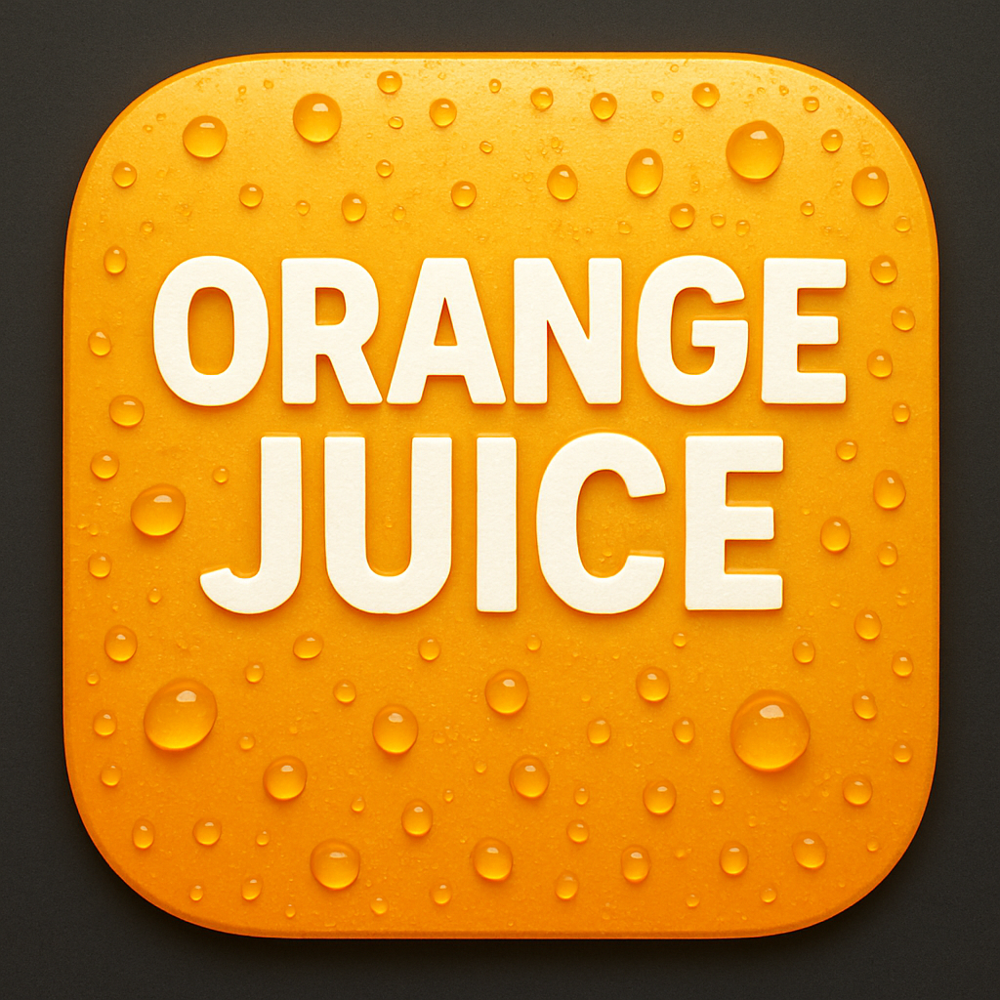

<meta name="google-site-verification" content="hdHpuNQq_ujr4eHU5wdi7yjcxFPPmoLAg3CQuxAJP4E" />


# Orange Juice makes Hacker News sweeter

## Motivation

I’ve been part of the Hacker News community since 2009, and over the years I’ve accumulated many ideas for improving the experience. I’ve used HNES, Refined Hacker News, and other extensions, and saved countless ideas along the way. Many promising projects were eventually abandoned. That may happen here too, but this is something I’ve wanted to explore personally for a long time. With AI making experimentation easier, now feels like the right time to do it.

The goal isn’t to redesign Hacker News. Its minimal UX works, and no one wants to relearn an interface that already does the job. Instead, this project focuses on small, thoughtful improvements—adding features and polish that make HN more pleasant to use without changing its core.

I’m also interested in exploring social features. HN is already a massive social network, but interactions feel fragmented. There’s room for tools that make engagement richer, not through obvious features like live chat, but through more creative, viral ideas I plan to experiment with. Keeping the extension open source is critical for trust; the last thing I want is for it to become a liability to the community.

# Features

I’m intentionally not adding screenshots. Things are still changing, and I don’t want to constantly update feature visuals that will quickly be out of date. More importantly, the extension isn’t meant to be loud or attention-grabbing. Ideally, you shouldn’t really notice it at all. The features should feel subtle but natural: visible, useful, and aligned with what most users would expect the site to have supported in the first place. As we grow the feature set, it should always be with respect to the original design.

<details>
<summary>Click to expand detailed summaries</summary>

## Inline Reply
Clicking a "reply" link now opens an inline reply form directly on the page, eliminating the need to navigate to a separate comment page. The form includes support for quoting selected text.

## Favorite Items
Add a "favorite" button to comments and stories across various pages of HN, allowing you to save items for later reference. The button updates in place without redirecting you to a new page.

## Hide read stories
There is a checkbox displayed at the top of story pages that hides any stories you've already read. It uses the browser's history API to determine if a link has been visited before.

## Past Page Date Picker
Navigate historical front pages with an interactive date picker on the `/front` page. Select any year since 2007, month, and day to view what was on the front page on that date. The picker defaults to yesterday and automatically prevents selecting future dates, dynamically adjusting available months and days based on today's date.

## Enchanced Submission UX
- **Character Count for Story Submissions**: When submitting a new story, a character counter appears next to the title input field showing how many characters remain until you reach the 80-character limit.
- **Fetch Title Button**: A "fetch title" button appears next to the URL input field on the story submission form. Click it to automatically retrieve and populate the title from the provided URL, saving time when submitting links.


## Enhanced User/Profile UX
- **User Info on Hover**: Hover over any username to see a popup with user details including account creation date, karma, number of submissions, and their about section. New users (less than 1 month old) are highlighted in green. The popup stays open when you move your mouse over it, making it easy to click links in the about section.
- **Profile Links Dropdown**: Click on your username in the top navigation to reveal a dropdown menu with quick access to your profile, submissions, comments, hidden items, upvoted items, and favorites. The menu allows you to navigate to any of your profile pages without leaving the current page.
 **Profile about clickable links**: In the about section for a user, if they have put links in, make them clickable.

## Enhanced Comment UX
Improves the comment reading experience with several visual enhancements:
- **Highlight Unread Comments**: Tracks comments you've read and highlights new ones with an orange left border. When you revisit a thread within 3 days, new comments added since your last visit are clearly marked. The highlight becomes brighter on hover for easy identification.
- **Custom indent width**: Comment indentation is adjusted to 40px width, making deeply nested threads easier to follow.
- **Visual indent guides**: A subtle shadow appears on the left edge of indented comments, providing a visual guide to thread structure.
- **Clickable indent to collapse**: Click on the indent area to collapse or expand comment threads, providing the same functionality as the collapse/expand toggle button.
- **OP highlighting**: The original poster's username is marked with an `[op]` label and displayed in orange, making it easy to identify their comments throughout the thread.
- **Enhanced code formatting**: Code blocks and inline code snippets get improved styling with a light gray background and rounded corners for better readability.
- **Dead comment styling**: Comments marked as `[dead]` by moderators are displayed in a distinct muted color (#d89899), making it clear when a comment has been removed or flagged.

</details>

# Installation

1. **Download the latest release**

   Visit the [releases page](https://github.com/OrangeJuiceExtension/OrangeJuice/releases/latest) and download the `.zip` file for your browser. Double-click on the `.zip` file to extract it into a folder.


2. **Install in Chrome**

   - Open Chrome and navigate to `chrome://extensions/`
   - Enable "Developer mode" using the toggle in the top right
   - Click "Load unpacked" and select the extracted folder from the `.zip` file
   - The extension should now be active

3. **Install in Firefox**

   - Open Firefox and navigate to `about:debugging#/runtime/this-firefox`
   - Click "Load Temporary Add-on..."
   - Navigate to the extracted folder and select the `manifest.json` file
   - The extension should now be active

Note: Temporary extensions in Firefox are removed when you restart the browser. For a permanent installation, you'll need to install from Firefox Add-ons once the extension is published there.

# Development

1. **Install Bun**
   Follow the instructions at https://bun.sh

2. **Clone the repository**
   ```bash
   git clone https://github.com/OrangeJuiceExtension/OrangeJuice.git
   cd OrangeJuice
   ```

3. **Install dependencies**
   ```bash
   bun install
   ```

4. **Run the extension in development mode**
   ```bash
   bun run dev
   ```

This should automatically open a Chrome window with the extension loaded. If you'd like to add it to your own browser, `bun run build`, then drop the .output/chrome-mv3 folder onto the Extensions tab of your browser.

**Note on releases:** For now, there are no official releases. The project is still evolving quickly, and I'm actively changing data structures. Locking in backwards compatibility would slow things down more than it helps at this stage.

# Tests

## Why Testing Matters

Testing is crucial for maintaining code quality and preventing regressions as the extension evolves. Unit tests help ensure individual components work correctly and make refactoring safer. They provide confidence when adding new features or making changes to existing code. All code contributions should come with tests. Fact is that AI makes this a lot easier now, so you might as well take advantage of it.

## E2E

We haven't implemented end-to-end testing yet because it doesn't seem necessary at this stage. The extension's features are relatively straightforward, and manual testing has been enough for catching integration issues. As the project grows in complexity, we may revisit this decision.

Make sure to run `bunx playwright install` before running tests.
