<meta name="google-site-verification" content="hdHpuNQq_ujr4eHU5wdi7yjcxFPPmoLAg3CQuxAJP4E" />
<picture>
  <source media="(prefers-color-scheme: dark)" srcset="docs/assets/og-card-dark-1200x630.png">
  <source media="(prefers-color-scheme: light)" srcset="docs/assets/og-card-1200x630.png">
  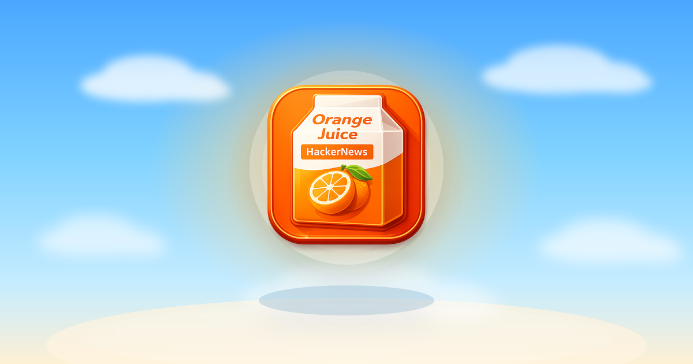
</picture>

# Orange Juice makes Hacker News sweeter

## Table of Contents

- [Motivation](#motivation)
- [Features](#features)
- [Installation](#installation)
- [Development](#development)
- [Tests](#tests)

## Motivation

I’ve been on Hacker News since 2009 and have had a running list of small things I wished it did better. I’ve used HNES, Refined Hacker News, and a bunch of other extensions over the years. Some were great, but most eventually died out. This is my attempt to build the version I actually want to use.

The goal isn’t to redesign Hacker News. The site mostly works. I just want to smooth out the rough edges, add a few missing features, and make it nicer to use without changing what makes it feel like HN.

I’m also interested in the social side of the site. HN already works like a social network, but a lot of the interaction is scattered and hard to follow. I want to experiment there too, while keeping the project open source and easy to trust.

# Features

## Feature Screenshots

This is not a complete list of features, but rather a selection that showcases the extension's capabilities and should be enticing enough to get you to want to install and try out this extension.

| Feature | Light | Dark |
| --- | --- | --- |
| Inline Reply + Quote Selection | 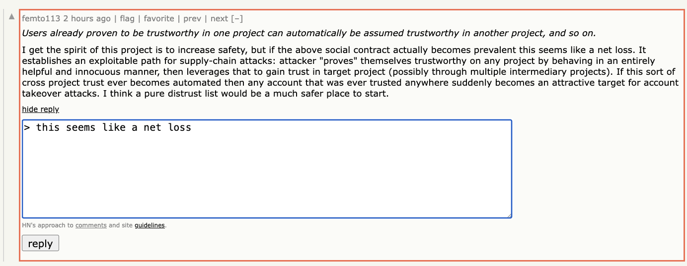 | 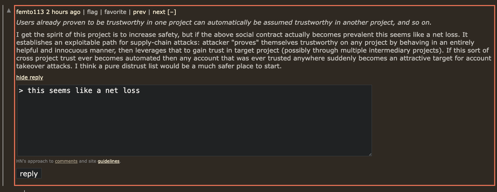 |
| Unread Comment Highlighting | 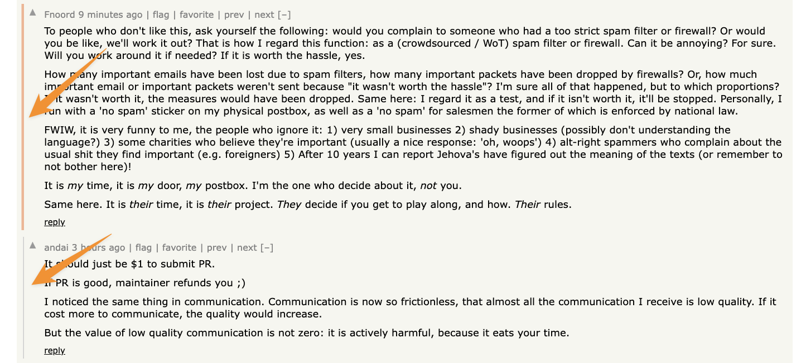 | 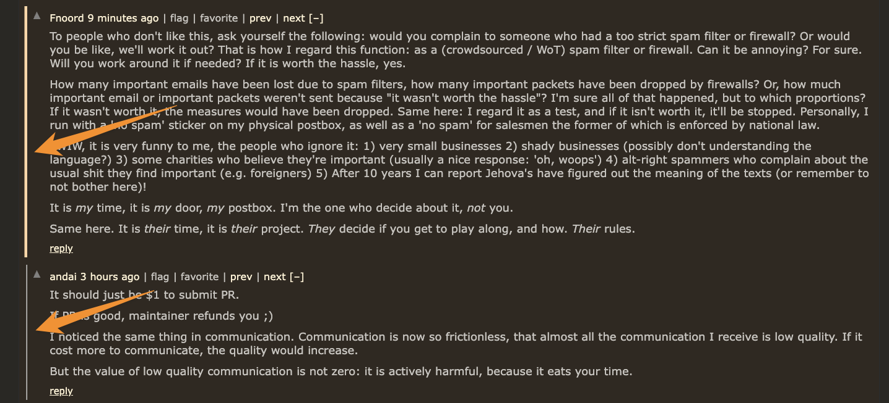 |
| Hover User Details | 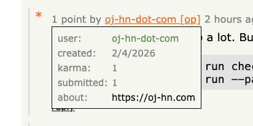 | 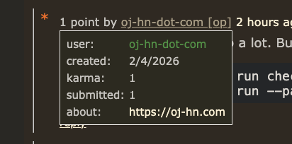 |
| Following Feed | Follow people and open a dedicated activity page for recent comments and submissions. | Cached locally with per-user refresh, reorder, and collapse state. |
| Hide Read Stories | 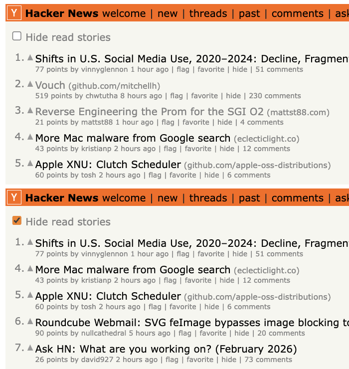 | 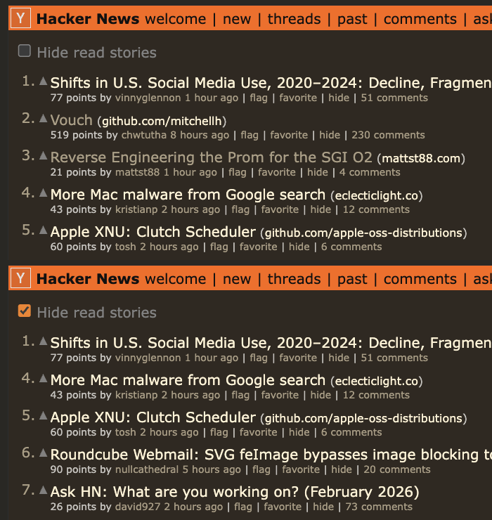 |
| Keyboard Navigation | 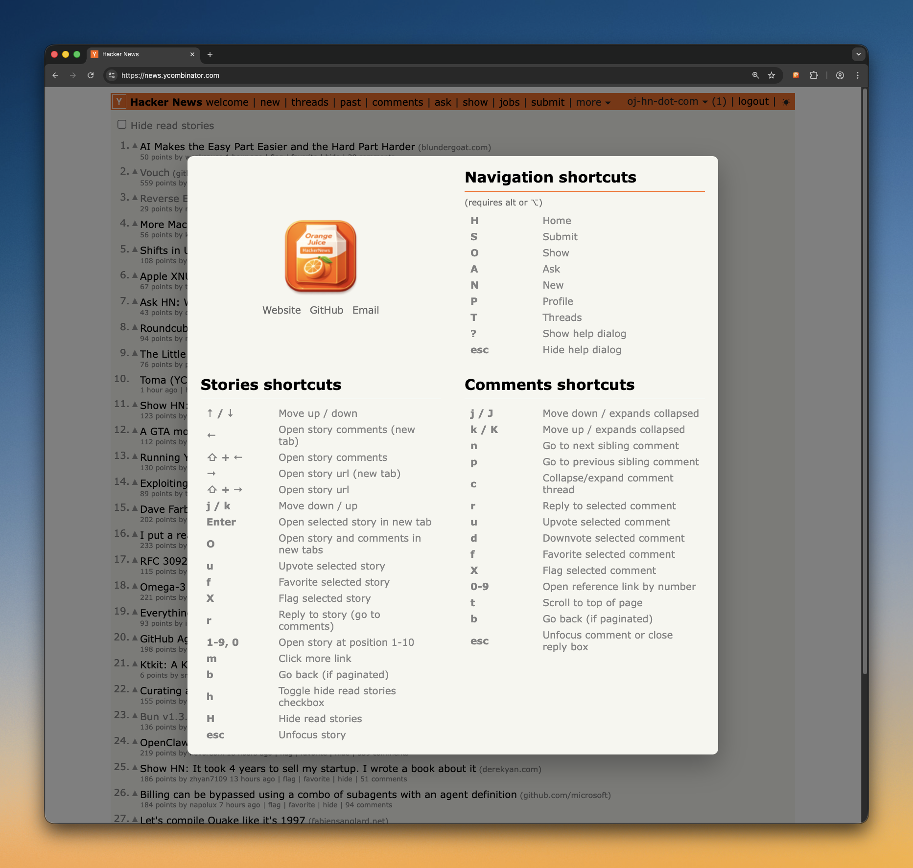 | 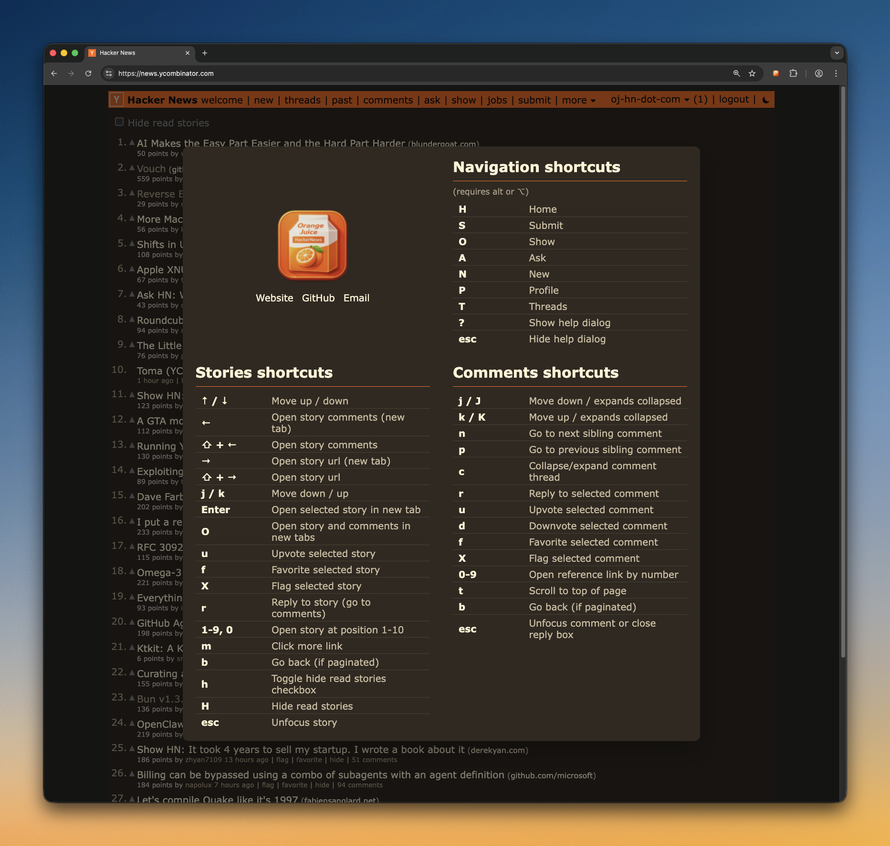 |
| Mermaid Diagram Rendering | [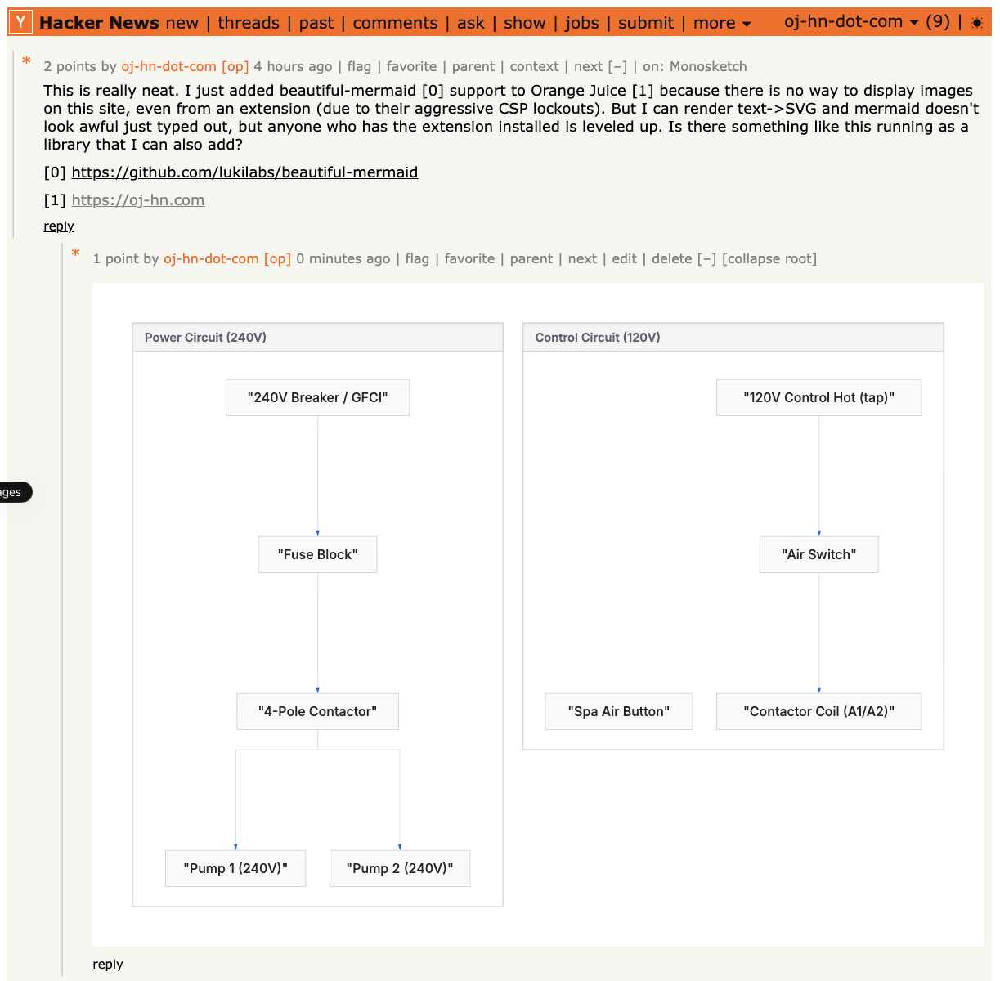](docs/assets/mermaid-light.png) | [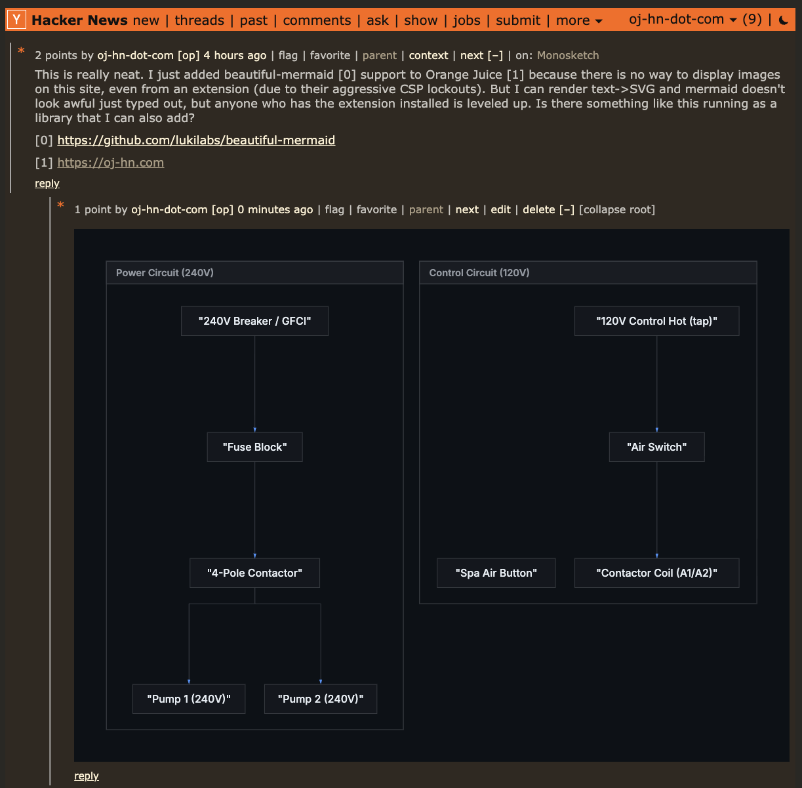](docs/assets/mermaid-dark.png) |

Ideally, you shouldn’t really notice it at all. The features should feel subtle but natural: visible, useful, and aligned with what most users would expect the site to have supported in the first place. As we grow the feature set, it should always be with respect to the original design.

<details>
<summary style="font-size: 1.6em; color: darkorange; font-style: italic">Click to expand detailed summaries</summary>

## Inline Reply
Clicking a "reply" link now opens an inline reply form directly on the page, eliminating the need to navigate to a separate comment page. The form includes support for quoting selected text.

## Favorite Items
Add a "favorite" button to comments and stories across various pages of HN, allowing you to save items for later reference. The button updates in place without redirecting you to a new page.

## Following Feed
- **Follow users directly from HN**: Small follow buttons appear next to usernames so you can build a personal follow list without leaving the page.
- **Dedicated `/following` page**: Open a combined feed of recent comments and submissions from the users you follow, rendered in the normal HN style.
- **Comment context included**: Comment entries show the parent story title, quick links for reply/comments, and relative timestamps so you can decide what to open next faster.
- **Local persistence and controls**: Followed-user order, expanded/collapsed sections, and recent fetched data are stored locally. Reorder the usernames by dragging, collapse noisy users by default, and refresh a single user when you want fresh data without reloading everything else.

## Hide read stories
There is a checkbox displayed at the top of story pages that hides any stories you've already read. It uses the browser's history API to determine if a link has been visited before.

## Past Page Date Picker
Navigate historical front pages with an interactive date picker on the `/front` page. Select any year since 2007, month, and day to view what was on the front page on that date. The picker defaults to yesterday and automatically prevents selecting future dates, dynamically adjusting available months and days based on today's date.

## Hidden page links
There are a number of urls which are not exposed in the regular HN ux. Add a 'more links' dropdown to the navbar to show those links.

## Enchanced Submission UX
- **Character Count for Story Submissions**: When submitting a new story, a character counter appears next to the title input field showing how many characters remain until you reach the 80-character limit.
- **Fetch Title Button**: A "fetch title" button appears next to the URL input field on the story submission form. Click it to automatically retrieve and populate the title from the provided URL, saving time when submitting links.

## Enhanced User/Profile UX
- **User Info on Hover**: Hover over any username to see a popup with user details including account creation date, karma, number of submissions, and their about section. New users (less than 1 month old) are highlighted in green. The popup stays open when you move your mouse over it, making it easy to click links in the about section.
- **Mute users from hover cards**: The user hover popup now includes a mute toggle. Muted usernames are stored locally as an array in local storage, and their comments are styled like dead comments on thread pages so noisy users fade into the background without altering the underlying page data.
- **Profile Links Dropdown**: Click on your username in the top navigation to reveal a dropdown menu with quick access to your profile, submissions, comments, hidden items, upvoted items, and favorites. The menu allows you to navigate to any of your profile pages without leaving the current page.
- **Profile about clickable links**: In the about section for a user, if they have put links in, make them clickable.
- **Load top leaders karma**: On the /leaders page, show the karma for the top 10

## Keyboard Navigation
Navigate stories and comments efficiently with keyboard shortcuts.

## Dark Mode
Adds a site-wide dark mode that preserves Hacker News visual structure while improving contrast and readability across stories, comments, templates, and help dialogs.

## Enhanced Comment UX
Improves the comment reading experience with several visual enhancements:
- **Highlight Unread Comments**: Tracks comments you've read and highlights new ones with an orange left border. When you revisit a thread within 3 days, new comments added since your last visit are clearly marked. The highlight becomes brighter on hover for easy identification.
- **Custom indent width**: Comment indentation is adjusted to 40px width, making deeply nested threads easier to follow.
- **Visual indent guides**: A subtle shadow appears on the left edge of indented comments, providing a visual guide to thread structure.
- **Clickable indent to collapse**: Click on the indent area to collapse or expand comment threads, providing the same functionality as the collapse/expand toggle button.
- **OP highlighting**: The original poster's username is marked with an `[op]` label and displayed in orange, making it easy to identify their comments throughout the thread.
- **Enhanced code formatting**: Code blocks and inline code snippets get improved styling with a light gray background and rounded corners for better readability.
- **Dead comment styling**: Comments marked as `[dead]` by moderators are displayed in a distinct muted color (#d89899), making it clear when a comment has been removed or flagged.
- **Backticks to code**: Converts all backticks in comments to HTML code elements
- **GitHub-style emoji shortcodes**: Comment text renders shortcodes like `:heart:` and `:+1:` as emoji while leaving code examples untouched.
- **Collapse root button**: Adds a "collapse root" button to thread pages that allows you to collapse all top-level comments at once, making it easier to navigate long comment threads and focus on specific sub-discussions.
- **Auto-resize textarea**: Automatically adjusts the height of comment textareas based on their content, ensuring that users can see their entire comment without scrolling.

### Mermaid notes
Mermaid diagrams render automatically when wrapped in a `<mermaid>` block, with two leading spaces on every line inside the block. The spaces are represented by dots in the example below.

```html
..<mermaid>
    graph TD
    A[Start] --> B[Finish]
..</mermaid>
```
</details>

# Installation

## Chrome Web Store

https://chromewebstore.google.com/detail/orange-juice/jojpnpkbdjfpjjgjhdccgpbifipacaii

## Firefox Add-ons

https://addons.mozilla.org/en-US/firefox/addon/orange-juice-hn/

## From a GitHub release

Download the latest `.zip` from the [releases page](https://github.com/OrangeJuiceExtension/OrangeJuice/releases/latest), then pick your browser:

**Chrome**

- Open Chrome and navigate to `chrome://extensions/`
- Enable "Developer mode" using the toggle in the top right
- Click "Load unpacked" and select the extracted folder from the `.zip` file
- The extension should now be active, now visit [Hacker News](https://news.ycombinator.com) to see it in action.

**Firefox**

- Open Firefox and navigate to `about:debugging#/runtime/this-firefox`
- Click "Load Temporary Add-on..."
- Navigate to the extracted folder and select the `manifest.json` file
- The extension should now be active, now visit [Hacker News](https://news.ycombinator.com) to see it in action.

Note: Temporary extensions in Firefox are removed when you restart the browser. For a permanent installation, use [Firefox Add-ons](https://addons.mozilla.org/en-US/firefox/addon/orange-juice-hn/).

# Development

1. **Install Bun**
   Follow the instructions at https://bun.sh

2. **Clone the repository**
   ```bash
   git clone https://github.com/OrangeJuiceExtension/OrangeJuice.git
   cd OrangeJuice
   ```

3. **Install dependencies**
   ```bash
   bun install
   ```

4. **Run the extension in development mode**
   ```bash
   bun run dev
   ```

This should automatically open a Chrome window with the extension loaded. If you'd like to add it to your own browser, `bun run build`, then drop the .output/chrome-mv3 folder onto the Extensions tab of your browser.

# Tests

## Why Testing Matters

Testing is crucial for maintaining code quality and preventing regressions as the extension evolves. Unit tests help ensure individual components work correctly and make refactoring safer. They provide confidence when adding new features or making changes to existing code. All code contributions must come with tests. AI makes this a lot easier now, we might as well take advantage of it.

That said, this isn't perfect by any means... but it's a start!

## E2E

I'd love someone to take this on.

## Logged in

Not much testing has been done while logged out. This isn't a focus for now since the real benefits come from being logged in, but it's something to keep in mind as the project matures.

Make sure to run `bunx playwright install` before running tests.


# Stars

[](https://www.star-history.com/#OrangeJuiceExtension/OrangeJuice/&Date)
